# Procesverslag
Markdown is een simpele manier om HTML te schrijven.  
Markdown cheat cheet: [Hulp bij het schrijven van Markdown](https://github.com/adam-p/markdown-here/wiki/Markdown-Cheatsheet).

Nb. De standaardstructuur en de spartaanse opmaak van de README.md zijn helemaal prima. Het gaat om de inhoud van je procesverslag. Besteedt de tijd voor pracht en praal aan je website.

Nb. Door *open* toe te voegen aan een *details* element kun je deze standaard open zetten. Fijn om dat steeds voor de relevante stuk(ken) te doen.

## Jij

uitwerken voor kick-off werkgroep

### Auteur:
Noa Mok

#### Je startniveau:
Blauw

#### Je focus:
responisve design
 

## Je website

uitwerken voor kick-off werkgroep

### Je opdracht:
https://www.shownieuws.nl/ 

#### Screenshot(s) van de eerste pagina (small screen): 
 de 'homepage'
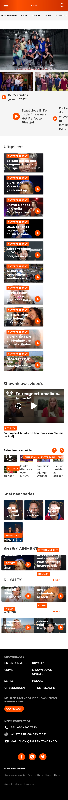

#### Screenshot(s) van de tweede pagina (small screen):
de 'podcast' pagina  
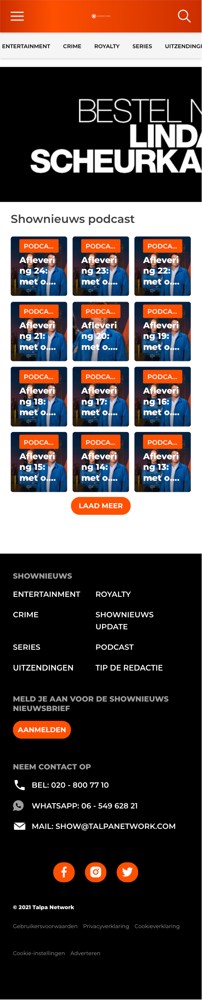
 

## Breakdownschets (week 1)

uitwerken na afloop 2e werkgroep

### de hele pagina: 
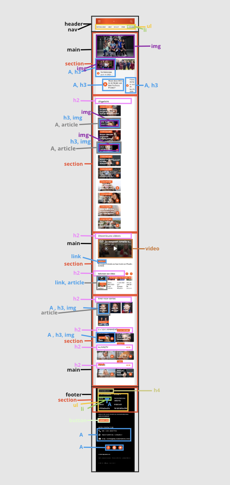

### dynamisch deel (bijv menu): 
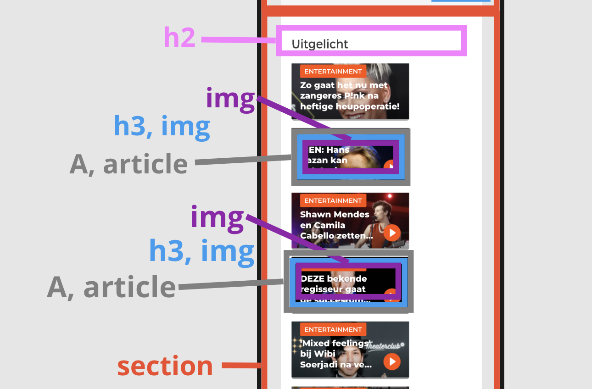

### wellicht nog een dynamisch deel (bijv filter): 
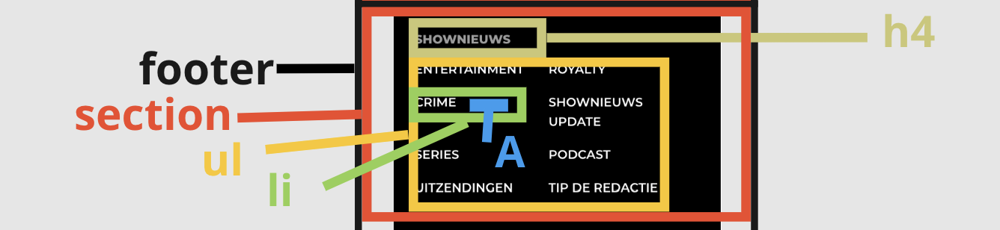

## Voortgang 1 (week 2)

uitwerken voor 1e voortgang

### Stand van zaken
Ik vind alles erin zetten niet zo moeilijk. Ik heb nog niet gekeken naar hoe ik het responsive moet maken want heb alleen nog op mobiele formaat zitten werken. Ik heb een paar vraagjes waar ik vast loop. 

In de footer gaat het nog niet zo goed en is nog niet alles op de juiste plek. 

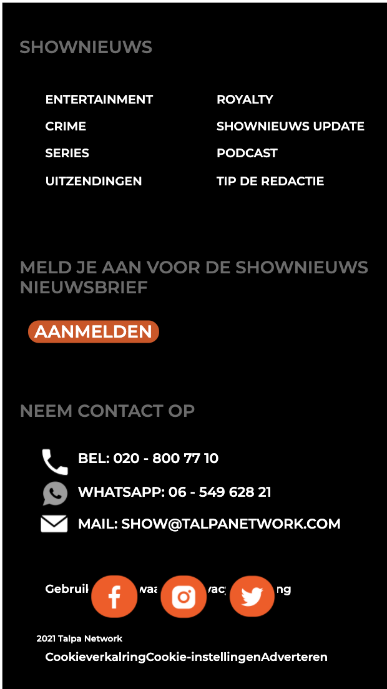
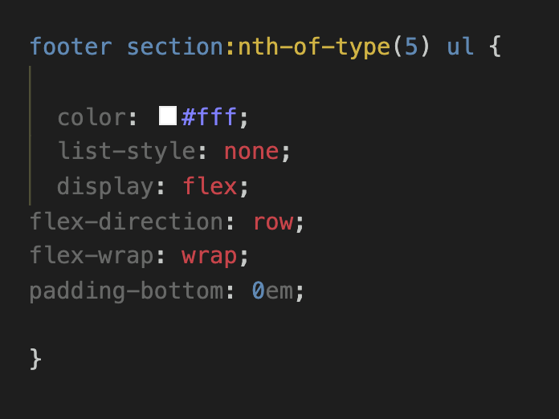
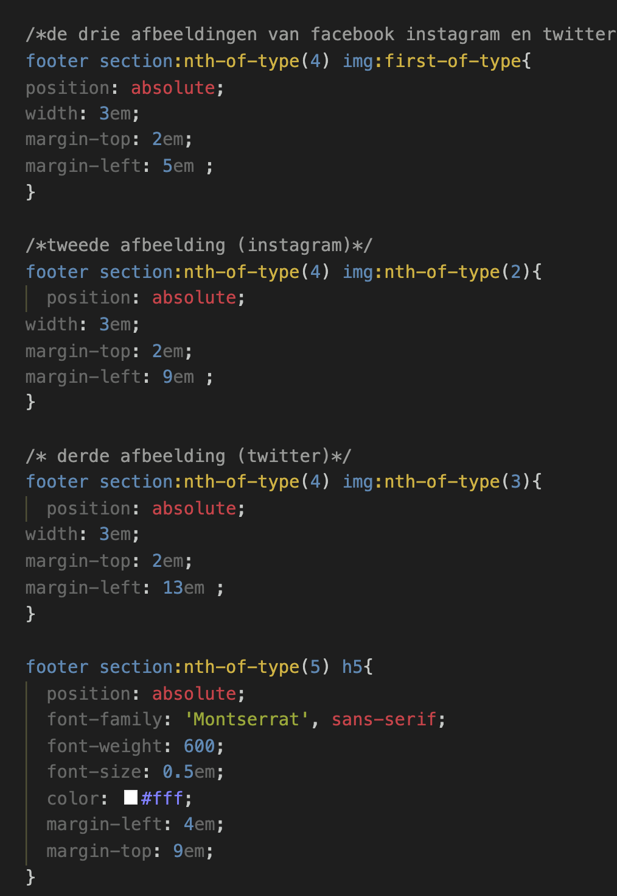

### Verslag van meeting
hier na afloop snel de uitkomsten van de meeting vastleggen

- Zorgen dat mijn footer er netjes uit gaat zien
- De knop 'aanmelden in de footer mooier maken (groter)
- De drie icoontjes van facebook, instagram en twitter een eigen plek geven 

## Voortgang 2 (week 3)

uitwerken voor 2e voortgang

### Stand van zaken
Ik heb mijn footer inmiddels gefixd met hulp van de student assistenten. Ik heb de punten
van vorige week doorgenomen en verbeterd.
Hier zie je hoe mijn footer is verbeterd:

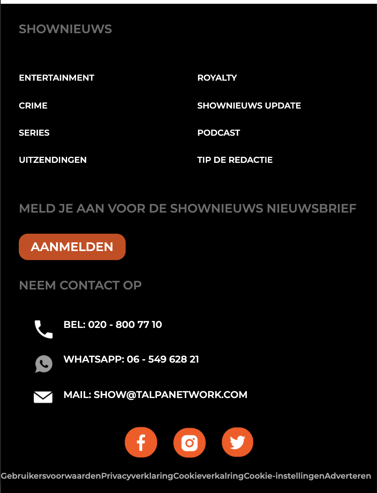

### Verslag van meeting
hier na afloop snel de uitkomsten van de meeting vastleggen

- Ik moet alles responsive maken
- Ik heb alles op mobiel formaat gemaakt. Nu moet ik gaan kijken hoe ik het op een groter scherm wil neerzetten
- breakpoints bepalen.

## Toegankelijkheidstest (week 4)

uitwerken na test in 8e voortgang

### Bevindingen
Lijst met je bevindingen die in de test naar voren kwamen:

### Tapbaar
Je kan niet door mijn website heen tappen ben ik achter gekomen. Dit is onhandig voor mensen die alleen een toetsenbord gebruiken. Hij pakt een linkje bovenaan en springt dan gelijk naar een linkje onderaan.
Dit komt omdat ik de linkjes in mijn website geen href heb gegeven:

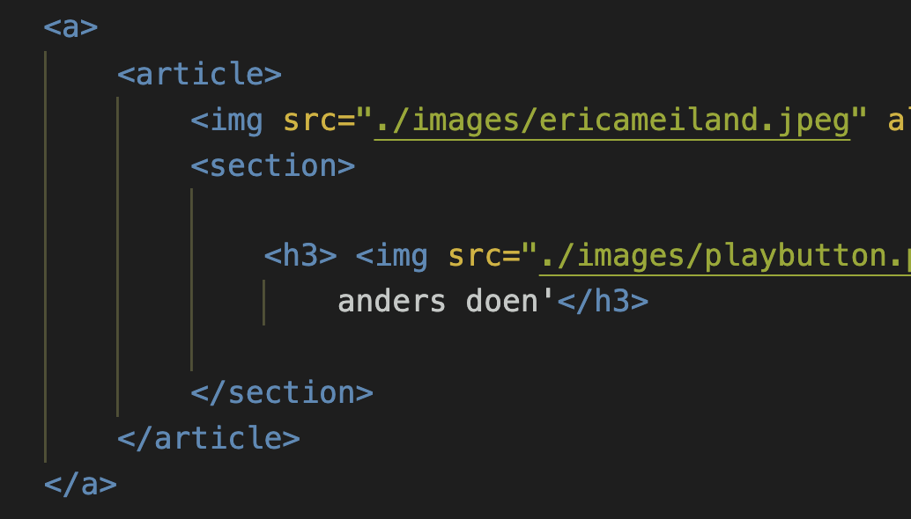

Ik kan dit oplossen door alle linkjes een href te geven. Hierdoor maak je ze tapbaar ookal zijn ze leeg:

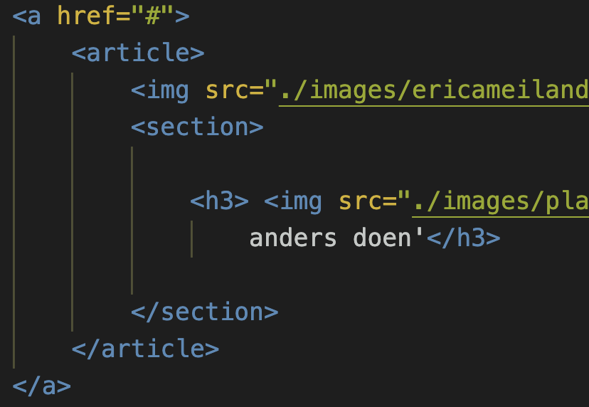

#### Gekke brillen. 
We moesten allemaal gekke brillen op om te zien hoe de website er dan uitziet. In princiepe vond ik dat je bij elke bril de website nog steeds kan zien zoals die bedoeld is.
Ook bij de kleurenblind bril. Er zitten niet veel kleuren in de styling van de website en dat hoeft ook niet. Het gaat om de inhoud, dus kleurenblinden kunnen prima gebruik maken van de webiste. 

#### Parkinson test. 
Om dit te testen kregen we een pijnlijk apparaatje die ons via onze armen tikjes gaf. Hierdoor werd de handling van door een website heen scrollen natuurlijk lastiger en uitdagender. 
Het was overigens niet onmogelijk om de informatie uit de website te halen die de gebruiker eventueel nodig heeft. 
Hoe vervelend die ziekte ook is, door de website scrollen lukt nog wel. 

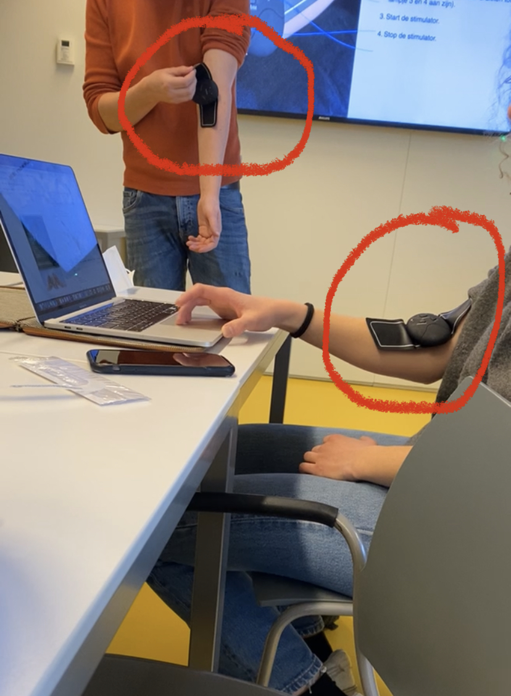

## Voortgang 3 (week 4)

uitwerken voor 3e voortgang

### Stand van zaken
Ik heb mijn tweede pagina in html gezet en gestijld. Ik heb nu twee pagina's die op mobiel formaat goed zijn. Ik moet ze nu door middel van media queries responsive maken. 

Hier zie je afbeeldingen van mijn tweede pagina:

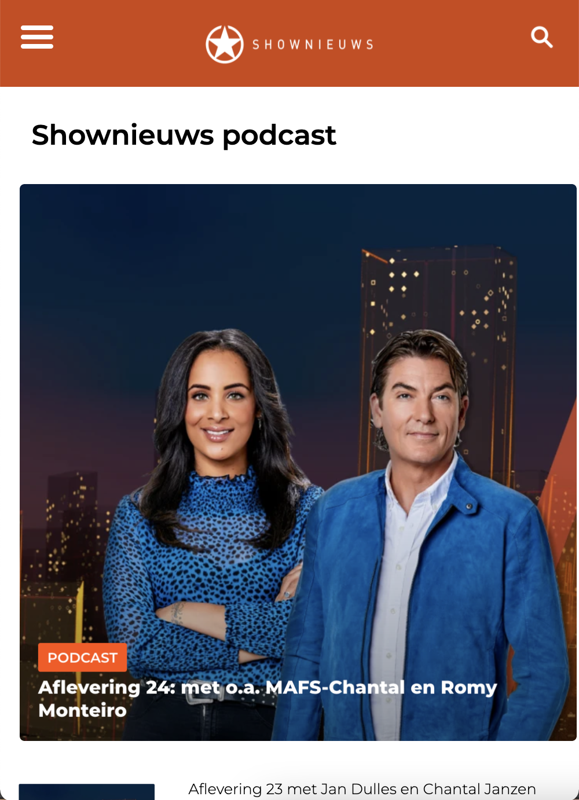

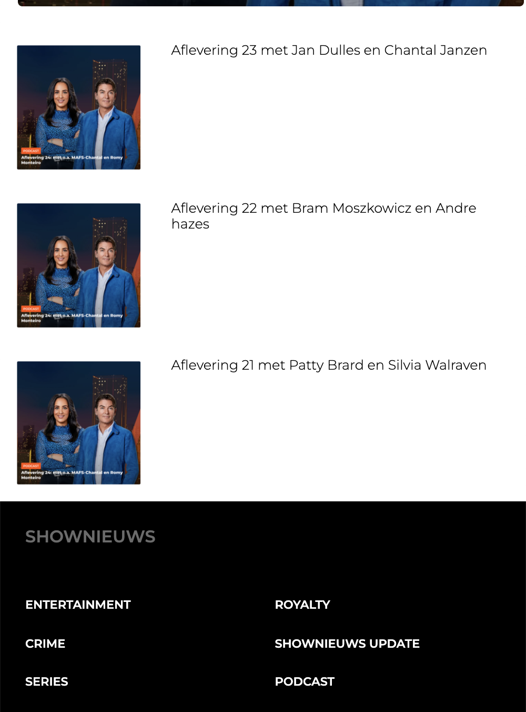

### Verslag van meeting
hier na afloop snel de uitkomsten van de meeting vastleggen

- Alles moet responsive worden
- breakpoints bepalen
- youtube video over media queries bekijken en toepassen

## Eindgesprek (week 5)

uitwerken voor eindgesprek

### Stand van zaken
Mijn eindgesprek is een beetje anders gelopen dan normaal.
Op het moment van mijn mondeling was ik heel erg ziek waardoor ik deze niet heb kunnen doen.
Toen heb ik op het herkansing moment m'n eerste mondeling had. 
Hier zijn een paar punten naar voren gekomen die ik moest verbeteren voor een voldoende.
Zodra ik dit heb gedaan moet ik met de examencomissie regelen dat ik een extra herkansing krijg om het vak te halen.

Hieronder een screenshot van wat ik moest verbeteren voor een voldoende.

Deze dingen heb ik gelijk aangepast en als het goed is heb ik dan eindelijk een voldoende voor dit vak.
Mijn procesverslag is in orde en mijn website is voor zover ik iets begrijp van code, voldoende :)
Ondanks alle gedoe over het afname moment van mijn mondeling en herkansing vond ik dit verrassend genoeg een erg interessant vak waar ik veel aan heb gehad! 

### Screenshot(s)

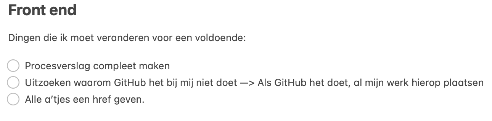
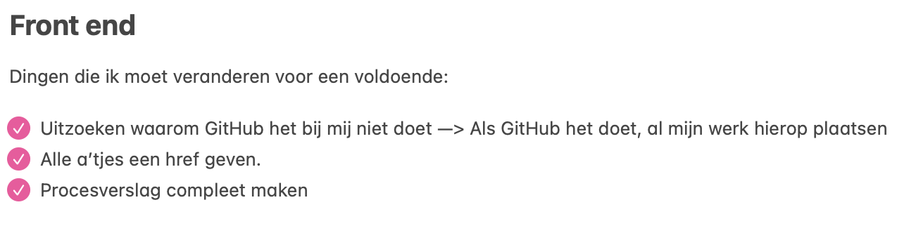

## Bronnenlijst

Ik heb niet heel veel bronnen gebruikt omdat ik voornamelijk alles heb gedaan met de student assistenten.
Ook heb ik alle video's bekeken die aan mij werden gegeven via dlo.

1. https://www.youtube.com/watch?v=2KL-z9A56SQ&t=101s 

